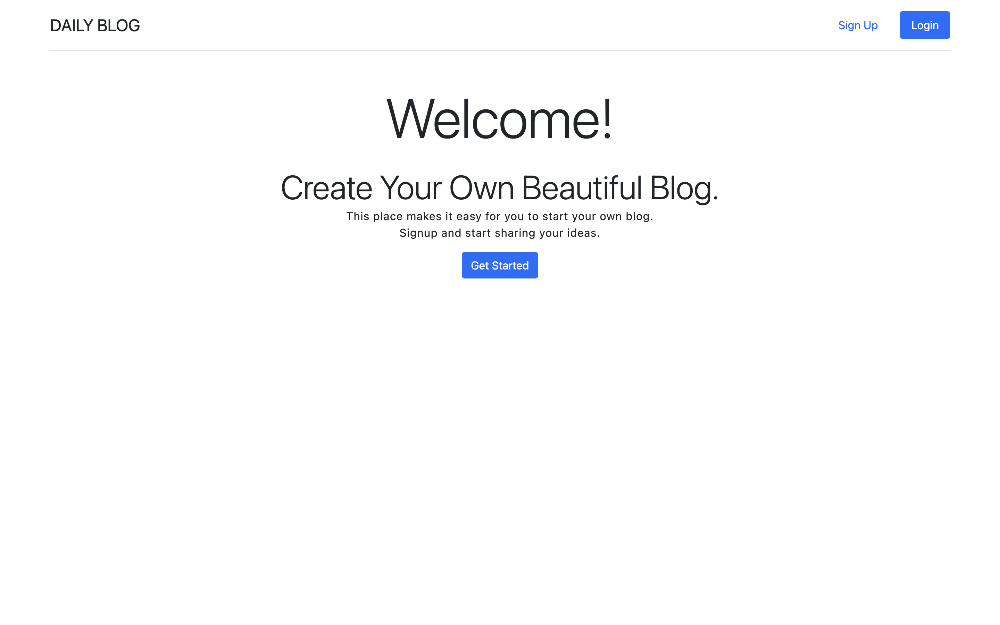

Blog App front-end using ReactJs and Bootstrap.

1. Clone the repo and cd daily-blog-web
2. Install all the packages using npm i
3. Setup .env file
4. Make sure the backend server is running
5. Run the front-end server using npm start

This is my first full-stack project. 
Frontend is created using ReactJs, Bootstrap, and Axios.
Backend is created using ExpressJs, TypeORM, and PostgreSQL.

